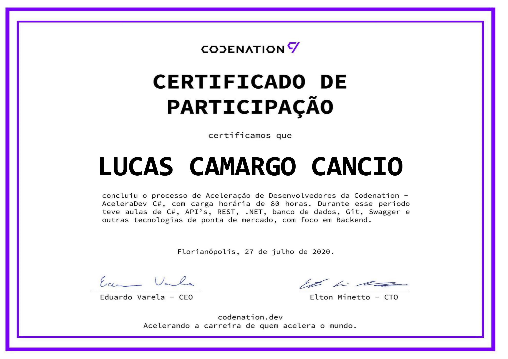

<h1 align="center">Aceleração C#</h1>
<h4 align="center">Programa AceleraDev C#, patrocinado pela Stone</h4>

## 🤔 O que é o AceleraDev?

Criado pela Codenation, é um programa de capacitação gratuito para profissionais de tecnologia. 
Durante 10 semanas, devs e cientistas de dados têm acesso a desafios, conteúdos e à Comunidade Codenation para adquirirem e praticarem as habilidades técnicas mais utilizadas por empresas de tecnologia de todo o mundo.

## ⚙ Como funciona? 

O programa é dividido em módulos semanais dentro da nossa plataforma. Os módulos contam com aulas, conteúdos na plataforma, desafios e desenvolvimento do projeto prático ao longo das semanas do programa

## 📚 Módulos

- 1º- Apresentação do curso
- 2º- Programação Estruturada e Orientada a Objetos
- 3º- Generics / Extensions / Exceptions / Linq / Lambda
- 4º- SOLID / TDD / Clean Code 
- 5º- Banco de dados / Entity Framework
- 6º- Web / WebAPI / FluentAPI
- 7º- Padrões de Projeto / Swagger / ASPNET Identity
- 8º- Docker
- 9º- Deploy
- 10º- Projeto prático

## 🚀 Desafios

- [Fibonacci](https://github.com/LucasCancio/aceleradev-csharp/tree/master/csharp-0)
- [Backend para gerenciar times de futebol](https://github.com/LucasCancio/aceleradev-csharp/tree/master/csharp-1)
- [Criptografia de Júlio César](https://github.com/LucasCancio/aceleradev-csharp/tree/master/csharp-2)
- [Os dez maiores estados brasileiros em extensão territorial](https://github.com/LucasCancio/aceleradev-csharp/tree/master/csharp-3)
- [Gerador de frases do Monty Python](https://github.com/LucasCancio/aceleradev-csharp/tree/master/csharp-5)
- [ORM .Net](https://github.com/LucasCancio/aceleradev-csharp/tree/master/csharp-7)
- [Manipulação de dados através de serviços](https://github.com/LucasCancio/aceleradev-csharp/tree/master/csharp-8)
- [Manipulação de dados com C# através de Web API](https://github.com/LucasCancio/aceleradev-csharp/tree/master/csharp-9)
- [Segurança de acesso para Web API com JSON Web Token](https://github.com/LucasCancio/aceleradev-csharp/tree/master/csharp-10)

## 💻 [Projeto prático](https://github.com/LucasCancio/codenation-cadeoerro)

## ❤ Agradeço muito a [Codenation](https://www.codenation.dev/) e a [Stone](https://www.stone.com.br/)